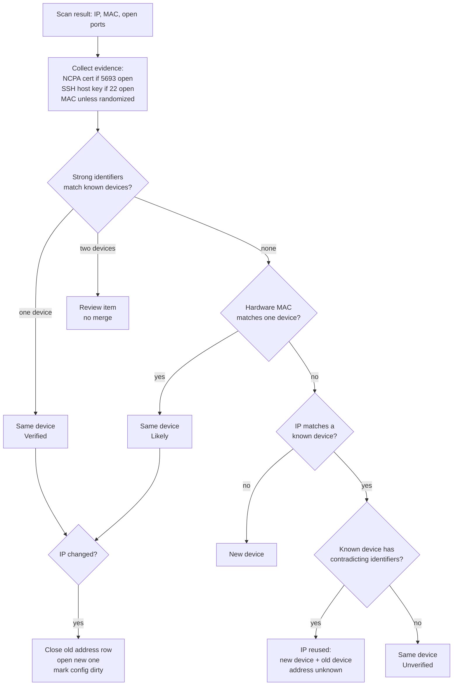
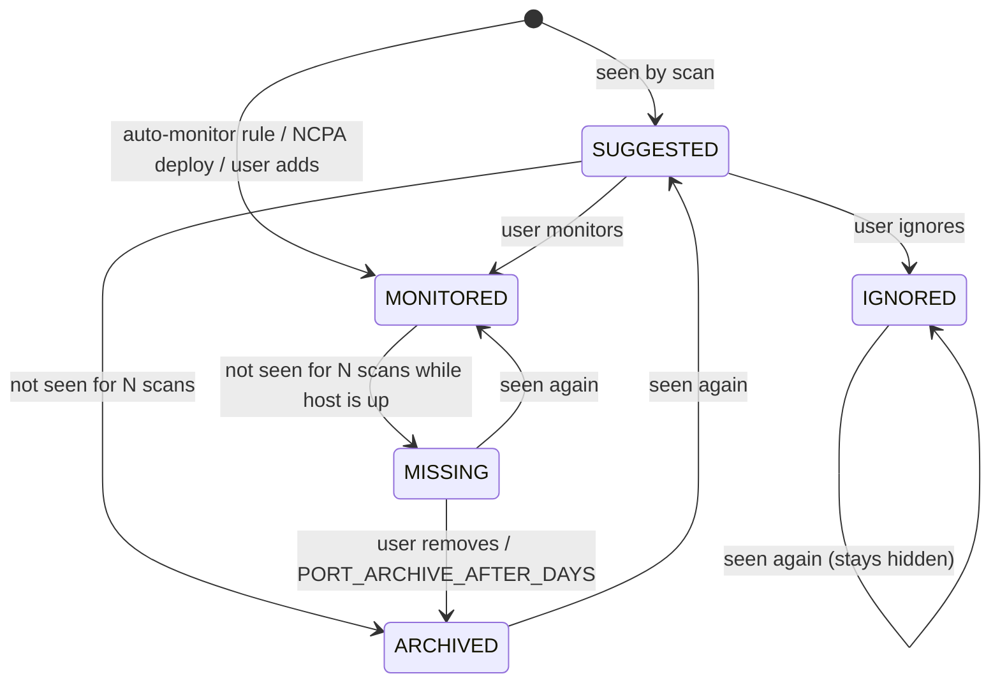

# Plan: DHCP Device Identity and Port Handling

**Status:** Proposal, for team review
**Scope:** `server/app/network_discovery/`, `server/app/ncpa_deployment/`, `server/app/system_models.py`, Device Inventory UI
**Related:** `pinpoint-dhcp-methods-comparison.md` (method catalogue — this plan picks from it and maps it onto the code)

---

## 1. Summary

Base Nagios Core monitors a host by IP address, so it only copes with static
IPs. PinPoint adds network discovery and NCPA, which reach devices on DHCP
addresses. Today PinPoint still treats the IP as the device's identity in
several places. When a lease changes, the next scan can create a second record
for the same device, keep checking the old IP, or attach one device's history
to another. Ports have a similar problem: one missed scan deletes a port and
its Nagios services, and every newly seen port becomes a service straight
away.

This plan changes three things:

1. **A device's identity is separate from its IP.** A device is matched by
   evidence that survives a lease change (NCPA TLS certificate, SSH host key,
   machine ID, hardware MAC). The IP becomes the device's *current address*,
   with a history.
2. **A scan observes, and a reconciler decides.** The scan reports what it
   saw. A reconciliation step matches each result to a known device, records
   address changes, and never merges two devices on weak evidence.
3. **Ports have a lifecycle.** A port is *suggested*, *monitored*, *missing*,
   *archived* or *ignored*. Monitored ports are only removed by a person or by
   a long timeout, and a single missed scan changes nothing.

The Nagios `host_name` becomes stable for the life of the device, so
`history.db`, acknowledgements and graphs survive an IP change.

---

## 2. How it works today

Flow: `discover_network()` → `_create_hostname()` → `_override_service_names()`
→ `_save_discovered_hosts()` → `_load_monitored_hosts()` → `_create_host_cfg_file()`
→ validate → apply (`server/app/network_discovery/create_host_cfg.py`).

### Device matching (`_save_discovered_hosts`)

- If nmap returned a MAC, the device is looked up by `(MAC_Address, Network)`.
- Otherwise it is looked up by `(IP_Address, Network)`.
- No match creates a new `NetworkDiscovery` row.

### What goes wrong

| # | Situation | What happens now | Effect |
|---|---|---|---|
| A | DHCP device gets a new IP, MAC visible (same L2 segment) | Matched by MAC, but **`IP_Address` is never updated** on an existing row (only Hostname, MAC, OS are). | Nagios keeps checking the old IP. The device looks DOWN, or another device answers in its place. |
| B | DHCP device gets a new IP, no MAC (routed subnet, or nmap can't see it) | Matched by IP → no match → **new row**. The old row is never removed. | Two devices in inventory and in `hosts.cfg`. The old one goes DOWN. NCPA must be redeployed on the "new" one. |
| C | A different device receives the old IP | Matched by IP → **merged into the old device's row**. | The new device inherits the old device's services, token and history. NCPA checks fail with an auth error, TCP checks test the wrong machine. |
| D | No reverse DNS name | `_create_hostname()` names it `<ip>.<DOMAIN>`, saved as `Hostname` and used as Nagios `host_name`. | The name changes with the IP. `HostStatus`, `ServiceStatus`, `AlertAcknowledgement` and `AckHistory` are all keyed by `Hostname`, so history and acks split. |
| E | Two devices resolve to the same reverse DNS name | Both become Nagios hosts with the same `host_name`. | `nagios -v` fails and the whole config is rejected. |
| F | Port missed in one scan (host busy, firewall, packet loss) | Port row is **deleted** in the same scan. | Its Nagios services disappear, with no alert. If it was NCPA's 5693, all NCPA metrics for that host vanish. |
| G | New port appears (temporary service, user app) | Immediately becomes a Nagios service. | Noise, and alerts when it closes again. |
| H | nmap's service guess changes (`Unknown` → `http`) | Service name is updated, so the plugin and Nagios service name change. | Service history splits. |

### Bugs found in the same code (fix first, Phase 0)

- **Update branch resets NCPA eligibility.** On an existing device, `NCPA_Eligible = False` is set unconditionally, so a Linux device loses eligibility on every rescan.
- **`SSH_Port = int(port_number)` uses a variable before it is assigned.** On the first new NCPA-eligible device in a scan this raises `UnboundLocalError` and the whole save is rolled back. On later devices it stores the last port of the *previous* host.
- **`Include_Device_In_Scanning`** is filtered on everywhere but nothing ever sets it to `False`.

---

## 3. Principles

1. **Never auto-merge on weak evidence.** A duplicate that a user can merge is better than two devices silently mixed together.
2. **The Nagios `host_name` never derives from an IP** and does not change after the device is created.
3. **Prove identity without leaking secrets.** Identity checks during a scan must not send an NCPA token to an unknown host.
4. **A monitored thing that disappears is an alert, not a deletion.** Removal is a deliberate action.
5. **Every automatic decision is visible and logged** (activity log + UI badge), and reversible where possible.

---

## 4. Identity model

### Evidence and strength

| Evidence | Collected | Strength | Notes |
|---|---|---|---|
| **NCPA TLS certificate fingerprint** | At NCPA deployment; checked on every scan with a TLS handshake to port 5693 | Strong | No secret sent. Requires a persistent per-device certificate (see §7). |
| **`/etc/machine-id`** | At NCPA deployment (SSH helper) | Strong | Stable per OS install. Cloned VMs can share it. Only available over SSH/NCPA. |
| **SSH host key fingerprint** | Already stored in `SSH_CREDENTIALS.Key_Fingerprint` at trust confirmation; collected in scans on `SSH_PORT` and on every port nmap identified as ssh | Strong | Uses existing `get_host_key_fingerprint()`. Changes on OS reinstall; cloned VMs can share. |
| **Hardware MAC** (universally administered) | nmap on the same L2 segment; `ip -o link` at deployment | Medium–strong | Absent across routers. Multi-NIC devices have several. |
| **Randomized MAC** (locally administered bit set) | nmap | Weak | Phones and some laptops. Treat like no MAC. |
| **Reverse DNS / NetBIOS / NCPA node name** | nmap `-R`, NCPA `/api/system` | Weak | Tiebreaker only. |
| **IP address** | nmap | Weak (DHCP) | Only the *current address*, never identity on its own for DHCP devices. |

### Confidence levels shown to users

| Level | Meaning |
|---|---|
| **Verified** | Matched by at least one strong identifier and no conflicting strong identifier. |
| **Likely** | Matched by a hardware MAC only. |
| **Unverified (IP-bound)** | No identifier beyond the IP. Behaves like base Nagios. The UI recommends a DHCP reservation or an agent. |

### Matching rules

For each scan result, collect its identifiers and find which known devices
share any of them.

| Result | Decision |
|---|---|
| Strong identifiers point to **one** device | Same device. If the IP differs, record an address change. |
| Only a hardware MAC matches one device, and no strong identifier contradicts it | Same device, confidence **Likely**. |
| Strong identifiers point to **two different** devices | **Conflict.** No merge. Create a review item. |
| Same IP as a known device, but a strong identifier or MAC **contradicts** it | **IP reuse.** Create a new device. Mark the old device's address as unknown (§6). |
| Same IP as a known device, no identifiers on either side | Same device, confidence **Unverified**. |
| Nothing matches | New device. |

---

## 5. Data model changes (`system_models.py`)

All application tables, so `system.db`. Ship with a migration (now that
`server/migrations/` is committed).

### `NetworkDiscovery` — new columns

| Column | Type | Purpose |
|---|---|---|
| `Nagios_Host_Name` | `String(100)`, unique | Set once at creation; used as Nagios `host_name`. Never derived from the IP. |
| `Display_Name` | `String(100)`, nullable | User-editable label. Changing it does not touch Nagios. |
| `Addressing` | `Enum(AddressingMode)`: `DHCP`, `STATIC`, `UNKNOWN` | Set by the user, or inferred after an observed change. |
| `Identity_Confidence` | `Enum(IdentityConfidence)`: `VERIFIED`, `LIKELY`, `UNVERIFIED` | Shown as a badge. |
| `Device_State` | `Enum(DeviceState)`: `ACTIVE`, `MISSING`, `ADDRESS_UNKNOWN`, `RETIRED`, `MERGED` | Lifecycle (§6). |
| `Merged_Into_ID` | FK → `NetworkDiscovery`, nullable | Set when a user merges a duplicate. |
| `First_Seen_At`, `Last_Seen_At` | datetime | |
| `Missed_Scans` | int, default 0 | Consecutive scans without seeing this device. |

`IP_Address` stays and always holds the **current** address. `Hostname`
stays as "name reported by DNS" and is no longer used for Nagios.

### New `DeviceIdentifier`

| Column | Notes |
|---|---|
| `IdentifierID` | PK |
| `NetDiscoveryID` | FK → `NetworkDiscovery` |
| `Kind` | `Enum(IdentifierKind)`: `NCPA_CERT`, `MACHINE_ID`, `SSH_HOST_KEY`, `MAC`, `DNS_NAME` |
| `Value` | normalized (lower-case MAC, base64 SHA-256 fingerprint, …) |
| `Is_Strong` | bool, derived from `Kind` (MAC is strong only if universally administered) |
| `First_Seen_At`, `Last_Seen_At` | |

Unique on `(Kind, Value)` for strong kinds, so one key cannot belong to two
devices. A multi-NIC device simply has several `MAC` rows.

### New `DeviceAddressHistory`

| Column | Notes |
|---|---|
| `AddressID` | PK |
| `NetDiscoveryID` | FK |
| `IP_Address`, `Network`, `MAC_Address` | as observed |
| `Source` | `Enum(AddressSource)`: `SCAN`, `NCPA_RELOCATE`, `MANUAL` |
| `First_Seen_At`, `Last_Seen_At`, `Closed_At` | open row = `Closed_At IS NULL` |

At most one open row per device. This is what the UI shows as "IP changed
from X to Y at T".

### Ports — `Open_TCP_Services` / `Open_UDP_Services`

Add to both (the commented-out `Closed_At` already hints at this):

| Column | Notes |
|---|---|
| `Port_State` | `Enum(PortState)`: `SUGGESTED`, `MONITORED`, `MISSING`, `ARCHIVED`, `IGNORED` |
| `Source` | `Enum(PortSource)`: `SCAN`, `NCPA`, `USER` |
| `Plugin_Name` | Frozen when the port becomes `MONITORED` (fixes problem H). |
| `First_Seen_At`, `Last_Seen_At`, `Closed_At` | |
| `Missed_Scans` | int, default 0 |

Unique constraint `(NetDiscoveryID, Port_Number)`. Saves become upserts, so a
rerun scan cannot duplicate a port.

### Existing data migration

- `Nagios_Host_Name` = current `Hostname` for every existing row, even the
  `<ip>.<domain>` ones. This keeps their `history.db` rows and acks attached.
  New devices get a non-IP name (§8).
- Existing MACs → `DeviceIdentifier(MAC)`; existing `Key_Fingerprint` →
  `DeviceIdentifier(SSH_HOST_KEY)`.
- Existing ports → `MONITORED` (preserves current behaviour). Port 5693 on
  devices with a deployed token → `Source = NCPA`.
- One open `DeviceAddressHistory` row per device from its current IP.
- `Identity_Confidence`: `VERIFIED` if a fingerprint exists, `LIKELY` if a
  hardware MAC exists, otherwise `UNVERIFIED`.

---

## 6. Device lifecycle

| State | Entered when | Nagios config |
|---|---|---|
| `ACTIVE` | Seen in the latest scan, or verified by relocation | Host + monitored services, at current IP |
| `MISSING` | Not seen for `DEVICE_MISSING_AFTER_SCANS` scans | Unchanged. Nagios reports it DOWN, which is the right signal. |
| `ADDRESS_UNKNOWN` | Its IP now belongs to a *different* device (IP reuse) | Host kept with `active_checks_enabled 0` and a note, so checks don't hit the wrong machine. Dashboard shows "Address unknown — waiting to be found". |
| `RETIRED` | `MISSING` or `ADDRESS_UNKNOWN` for `DEVICE_RETIRE_AFTER_DAYS`, or retired by a user | Removed from config. Records and history kept. |
| `MERGED` | A user merged it into another device | Removed from config. Ports, identifiers and address history moved to the target. |

A `MISSING` or `ADDRESS_UNKNOWN` device returns to `ACTIVE` as soon as a scan
or relocation matches it by identity.

---

## 7. NCPA devices: collect identity at deployment and relocate quickly

NCPA devices are where DHCP matters most and where we can do best, because
PinPoint already has root access during the install.

### At deployment (`install_deployment_helper` / `install_ncpa`)

Extend the remote helper script, which already prints partitions between
`PARTITIONS_BEGIN` / `PARTITIONS_END` sentinels, with an `IDENTITY_BEGIN` /
`IDENTITY_END` block:

- `cat /etc/machine-id`
- `ip -o link` → hardware MACs of physical interfaces
- `hostname`

Also have the helper **generate a persistent self-signed certificate** for
NCPA and point `ncpa.cfg` at it, instead of NCPA's `adhoc` certificate (to
verify: `adhoc` may regenerate on restart, which would make the fingerprint
useless). Record the certificate's SHA-256 fingerprint after
`verify_ncpa_reachable()` succeeds.

Store all of these as `DeviceIdentifier` rows. On a redeploy to the same
device, **reuse the existing token** instead of minting a new one.

Security: the helper only prints identifiers, never the token. The
`<token>` masking in `log_command` stays.

### During scans

If port 5693 is open on a result, open a TLS connection, read the
certificate fingerprint, and close. No token is sent. A matching fingerprint
identifies the device with certainty, even across subnets where no MAC is
visible.

Do **not** probe unknown IPs with stored tokens: every probe would hand a
token to whatever is listening on that IP.

### Relocation between scans

The default `scanFrequency` is 6 hours, so without this an NCPA device could
be checked at the wrong address for hours.

Add a scheduler job (`app/scheduler.py`) that runs every few minutes:

1. Find NCPA devices whose latest `HostStatus` is DOWN/UNREACHABLE, or whose
   NCPA services return auth or connection errors.
2. Run a fast `nmap -p 5693 --open` sweep of `NETWORKS` (no service or OS
   detection), rate-limited and skipped while a full discovery is running.
3. Fingerprint the TLS certificate on each responder and match it to those
   devices.
4. On a match: update the address (`Source = NCPA_RELOCATE`), regenerate,
   validate and apply the config, and log the change.

### Later option: NRDP passive checks

NCPA can push results to Nagios through NRDP, tagged with the host name, so
Nagios never needs the IP. This removes IP churn for NCPA devices entirely but
needs NRDP installed by the installer and a passive-check config per device.
Keep it as Phase 5, after the above has proven itself.

---

## 8. Stable Nagios host names

Assigned once when the device is created, in this order:

1. NCPA node name or reverse DNS name, sanitized, if not already used.
2. Otherwise `dev-<6 hex chars>.<DOMAIN>` derived from the row's ID or a UUID.
3. On collision, append `-2`, `-3`, ….

Never `<ip>.<domain>` for new devices. Changing the device's `Display_Name`
does not touch Nagios. Renaming `Nagios_Host_Name` is a separate admin action
with a warning that history for the old name won't carry over.

This also fixes problem E: names are unique by construction.

---

## 9. Port handling

### States

| State | In Nagios config? | Alerts? | Shown in UI |
|---|---|---|---|
| `SUGGESTED` | No | No | "Suggested services" list on the device |
| `MONITORED` | Yes | Yes | Normal |
| `MISSING` | **Yes** — Nagios will show the check CRITICAL, which is correct if the service is really gone | Yes | "Not seen in last N scans — remove?" |
| `ARCHIVED` | No | No | Collapsed history |
| `IGNORED` | No | No | Hidden; restorable |

### Rules

1. **A miss only counts if the host itself was seen in that scan.** If the
   host was down or not found, no port counters change.
2. **Hysteresis.** `Missed_Scans` must reach `PORT_MISSING_AFTER_SCANS`
   (default 3) before a state changes. Any sighting resets it to 0. This
   fixes problem F.
3. **Monitored ports are never auto-deleted.** They go to `MISSING` and stay
   in Nagios until a user removes them or `PORT_ARCHIVE_AFTER_DAYS` (default
   30) passes.
4. **NCPA's port is protected.** Port 5693 with `Source = NCPA` is never
   archived while the device has a deployed token, regardless of scans.
   `add_ncpa_port()` sets `Source = NCPA`, `Port_State = MONITORED`.
5. **Auto-monitor list.** First sighting of a port whose service is in
   `AUTO_MONITOR_SERVICES` (default: `ssh`, `http`, `https`, `snmp`, `ncpa`)
   goes straight to `MONITORED`. Everything else starts `SUGGESTED`. This
   fixes problem G while keeping the common services zero-touch.
6. **Frozen plugin.** When a port becomes `MONITORED`, its `Plugin_Name` and
   service label are frozen. A later different nmap guess is shown as a
   suggestion ("nmap now thinks this is http — switch plugin?") instead of
   renaming the Nagios service. Fixes problem H.
7. **Ephemeral ranges.** Ports in `EPHEMERAL_PORT_RANGES` (Linux
   32768–60999, Windows 49152–65535) are never suggested unless a user adds
   them. Today's `TCP_PORTS = 1-6000` mostly avoids them, but this matters if
   the range is widened or NCPA-reported listening sockets are used later.
8. **Host down hides service noise.** Nagios already suppresses service
   notifications while the host is DOWN. The dashboard alerts feed should do
   the same: collapse service alerts under a DOWN host into the host alert.

### Upserts

`_save_discovered_hosts` port handling becomes: for each scanned port, upsert
on `(NetDiscoveryID, Port_Number)`, set `Last_Seen_At`, reset
`Missed_Scans`. Then, for ports of that device not in the scan, increment
`Missed_Scans` and apply the state rules. No deletes.

---

## 10. Nagios config generation

Changes in `_load_monitored_hosts()` and `_create_host_cfg_file()`:

- Include devices in `ACTIVE`, `MISSING` and `ADDRESS_UNKNOWN`; skip `RETIRED` and `MERGED`.
- `host_name` = `Nagios_Host_Name`; `address` = current `IP_Address`.
- `ADDRESS_UNKNOWN` devices get `active_checks_enabled 0` and a `notes` line.
- Only `MONITORED` and `MISSING` ports produce services, using the frozen `Plugin_Name`.
- **Skip apply when nothing changed:** hash the generated config without the
  timestamp header, compare with the running `hosts.cfg`, and skip
  validate/apply/reload when equal. Scans then cause no reload unless
  something really changed.
- **One writer at a time:** discovery, `add_ncpa_port()`, relocation and
  user edits all regenerate `hosts.cfg`. Put generation + validate + apply
  behind a single lock so two of them can't interleave. The existing
  one-scan-at-a-time guard does not cover NCPA or relocation.

Existing validation (`nagios -v` against a temp `nagios.cfg`), backup and
rollback stay as they are.

---

## 11. API and UI

All routes follow the existing conventions (module docstring, `success`/`error`,
`@require_permission`, activity log entry for every change).

### Routes

| Route | Purpose | Permission |
|---|---|---|
| `GET /system/hosts/<id>/addresses` | Address history | `system.hosts` |
| `GET /system/hosts/<id>/identifiers` | Identifiers and confidence | `system.hosts` |
| `PUT /system/hosts/<id>` | Display name, addressing mode | `system.hosts.edit` *(new)* |
| `POST /system/hosts/<id>/merge` | Merge this device into another (`{"target_id": 12}`) | `system.hosts.edit` |
| `POST /system/hosts/<id>/retire` | Retire a device | `system.hosts.edit` |
| `PUT /system/hosts/<id>/ports/<proto>/<int:port>` | Change port state (`{"state": "MONITORED"}`) | `system.hosts.edit` |
| `GET /system/discover/review` | Conflicts and possible duplicates from the last scan | `system.discover` |

### UI (Device Inventory and scan results)

- Confidence badge per device (Verified / Likely / Unverified) with a tooltip
  explaining why.
- "IP changed from X to Y, T ago" line, and an address history panel.
- Scan results grouped: **New devices**, **Known devices that moved**,
  **Needs review**.
- Device actions: Merge into…, Retire, Mark as static / DHCP.
- Ports tab split into Monitored, Missing, Suggested, Ignored, with one-click
  actions.
- For Unverified DHCP devices: show the MAC (if known) and recommend a DHCP
  reservation or NCPA.

Note: per `AGENTS.md` §9, the badges and new sections need to be added to
`Display_Requirements.md` before they are built.

---

## 12. Settings

Add to `config.py` (or `SystemSettings` if they should be editable in the UI):

| Setting | Default | Meaning |
|---|---|---|
| `DEVICE_MISSING_AFTER_SCANS` | 5 | Scans before `ACTIVE` → `MISSING` |
| `DEVICE_RETIRE_AFTER_DAYS` | 30 | Days `MISSING` / `ADDRESS_UNKNOWN` before auto-retire |
| `PORT_MISSING_AFTER_SCANS` | 5 | Scans before a port is considered gone |
| `PORT_ARCHIVE_AFTER_DAYS` | 30 | Days a monitored port stays `MISSING` before archive |
| `AUTO_MONITOR_SERVICES` | `["ssh", "http", "https", "snmp", "ncpa"]` | Services monitored on first sighting |
| `EPHEMERAL_PORT_RANGES` | `[(32768, 60999), (49152, 65535)]` | Never suggested |
| `NCPA_RELOCATE_MINUTES` | 5 | Relocation job interval |

---

## 13. Edge cases

| Case | Handling |
|---|---|
| Two devices swap IPs between scans | Strong identifiers resolve it. For two Unverified devices it cannot be detected — documented limitation. |
| Cloned VMs (same machine-id / host key) | `(Kind, Value)` uniqueness raises a conflict → review item. UI suggests regenerating the machine-id and host keys. |
| OS reinstall (new host key and machine-id, same MAC) | MAC matches but strong identifiers contradict → review item "identity changed". **Never auto-accept a new SSH host key** — NCPA deployment must require trust confirmation again, as it does today. |
| Multi-NIC device seen on two IPs in one scan | Both match the same device. Keep one Nagios host at the primary address (the one NCPA was deployed to, else the first seen), record the other in address history. |
| Randomized MAC (phones) | Treated as no MAC → Unverified. |
| Routed subnet, no MAC | NCPA certificate and SSH host key still work; otherwise Unverified. |
| Device offline for weeks | `MISSING` → `RETIRED` after `DEVICE_RETIRE_AFTER_DAYS`. History kept. If it reappears and matches, it's reactivated. |
| PinPoint server itself | Still skipped via `get_monitoring_server_ips()`. |
| Device set to `STATIC` by the user, IP changes | Treat as a real event: still follow the device, but raise an alert-level log entry, since a static device moving is unexpected. |

---

## 14. Phases

Each phase is a separate PR with its own migration and tests (pytest, nmap
and SSH mocked, as existing tests do).

| Phase | Work | Tests |
|---|---|---|
| **0 — Fix current bugs** | Update `IP_Address` on MAC match; stop resetting `NCPA_Eligible`; fix `SSH_Port` unbound variable (use 22 / `SSH_PORT`); add a test for each. | Rescan with changed IP updates the row; Linux device keeps eligibility; first new Linux host saves. |
| **1 — Identity and reconciliation** | `DeviceIdentifier`, `DeviceAddressHistory`, new `NetworkDiscovery` columns, data migration. Replace matching in `_save_discovered_hosts` with the reconciler (§4) using MAC + SSH host key. Stable `Nagios_Host_Name` (§8). Device lifecycle (§6). Config-write lock. | One test per row of the §4 decision table; IP reuse → `ADDRESS_UNKNOWN`; host name unchanged after IP change; duplicate DNS names get unique Nagios names. |
| **2 — NCPA identity and relocation** | Helper prints identity block; persistent NCPA certificate; store identifiers; token reuse on redeploy; TLS fingerprint matching in scans; relocation scheduler job. | Helper output parsing; cert match across subnets with no MAC; relocation updates address and regenerates config; no token sent during probes. |
| **3 — Port lifecycle** | Port columns, unique constraint, upserts, hysteresis, auto-monitor list, frozen plugin, ephemeral filter, NCPA port protection. Only monitored/missing ports in config. Skip-apply when unchanged. | One missed scan changes nothing; three misses → `MISSING`; host down → no counters change; 5693 never archived; unchanged config → no reload. |
| **4 — UI and routes** | §11 routes and Device Inventory changes; spec update first. | Route tests for merge, retire, port state, permissions and activity log entries. Vitest for the new components. |
| **5 — Optional: NRDP** | Passive checks for NCPA devices; installer support. | Decide after Phase 2 is in use. |

Phases 0–1 fix the duplicate-device problem for the common case. Phase 3 can
run in parallel with Phase 2.

---

## 15. To verify before Phase 2

| Question | How |
|---|---|
| Does NCPA's `adhoc` certificate change on restart, and can `ncpa.cfg` point at a persistent cert on the version we install? | Install on a test VM, restart NCPA twice, compare fingerprints; then configure a generated cert. |
| Is the PinPoint server on the same L2 segment as the monitored devices in the target deployments? | Decides how much we can rely on MACs. |
| How fast is `nmap -p 5693 --open` over a /24 with our nmap wrapper? | Time it; sets a sensible relocation interval. |
| Does `/api/system` on our NCPA version return the node name? | Query a deployed agent. |
| Team decision: default `AUTO_MONITOR_SERVICES` list | Discuss — "monitor everything" keeps today's behaviour but keeps the noise. |

---

## 16. Known limitation

A device with **no agent, no SSH, no hardware MAC visible to PinPoint, and no
stable name** cannot be followed across IP changes by any method. PinPoint
labels it **Unverified (IP-bound)**, handles IP reuse safely (§4), and
recommends a DHCP reservation or NCPA for anything that matters.
